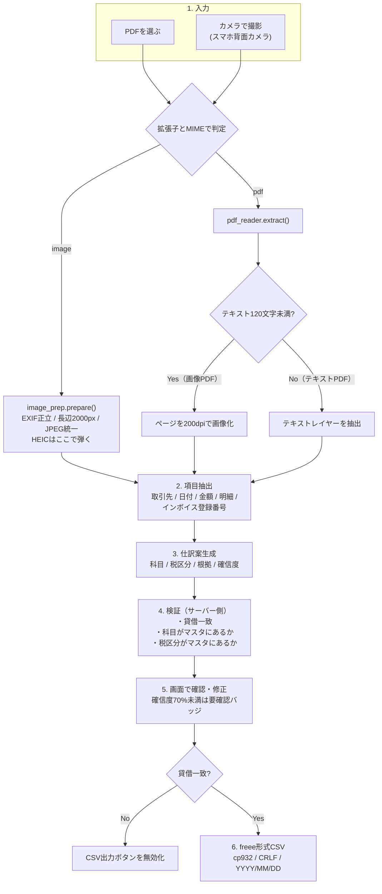
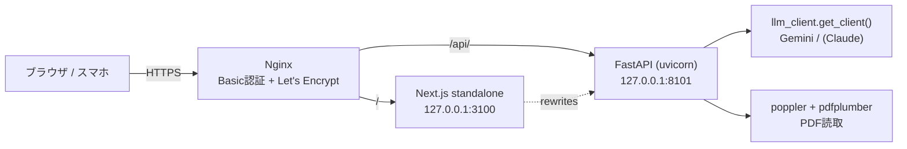

# 請求書仕訳AI（仮称）

**請求書のPDF・写真から、freee形式の仕訳案を生成する経理向けAIエージェント。**
経理担当者が「入力する人」から「確認する人」に変わることを狙った、承認フロー付きのWebアプリです。
最大の特徴は**AIに確定権限を持たせないこと** — AIは根拠つきの「案」を出すだけで、確定は必ず人間が行い、**貸借が一致しなければCSVを出力できません**。

> **設計思想**: AIは案を出すだけ。確定は必ず人間が行います（内部統制への配慮）。

- 公開デモ: <https://keiri.ai-l-a-b-o.com/>（Basic認証で保護しています）
- 勘定科目18科目・税区分5種（freee準拠）／インボイス登録番号の有無で税区分を切り替え
- 確信度70%未満の仕訳には「要確認」バッジ。**なぜその科目・その税区分なのか**を必ず表示
- FastAPI + Next.js + Gemini。モデル名は環境変数化してあり、差し替えは `.env` の1行
- AI APIを呼ばずに動く機能テスト45件（全PASS）

---

## 目次

- [課題と解決](#課題と解決)
- [特徴](#特徴)
- [アーキテクチャ](#アーキテクチャ)
- [データ定義](#データ定義勘定科目と税区分)
- [動作環境](#動作環境)
- [セットアップ手順](#セットアップ手順)
- [使い方](#使い方)
- [テスト](#テスト)
- [設計判断とその理由](#設計判断とその理由)
- [制限・未検証の領域](#制限未検証の領域)
- [ディレクトリ構成](#ディレクトリ構成)
- [注意事項](#注意事項)

---

## 課題と解決

請求書の仕訳入力は、単純作業に見えて判断が要る作業です。「この請求書は何費か」「税率は10%か8%か」「インボイス登録番号があるか」を1件ずつ見て決めています。

一方で、**AIに丸ごと任せることもできません。** 会計帳簿は監査の対象であり、誰がいつ何を根拠に決めたかを説明できる必要があるためです。

| 課題 | このアプリでの解決 |
| --- | --- |
| **仕訳入力は判断を伴うので、単純な自動化ができない** | AIが科目・税区分・金額を推定し、**推定根拠（`reason`）を必ず添えて**提示する。人間は「入力」ではなく「確認」をする |
| **AIに承認させると、内部統制が成立しない** | AIの出力は常に「案」。画面で修正でき、承認するまでCSVは出ない。**AIが確定できる経路をコードに作っていない** |
| **AIの誤りは、確信を持って間違えるので気づきにくい** | 確信度を0〜1で出させ、**0.7未満は「要確認」バッジ**を表示。読み取れない項目は空文字ではなく `null` を返させ、推測で埋めさせない |
| **数字が合っていない仕訳が出力されると、後工程で事故になる** | 借方合計と貸方合計を**サーバー側とUIの両方で検証**し、不一致ならCSV出力ボタンを無効化する |
| **インボイス制度で、登録番号の有無によって仕入税額控除の扱いが変わる** | 登録番号（T+13桁）の有無を判定し、無ければ税区分を「課対仕入10%(区分記載)」に切り替え、経過措置の確認事項を警告に載せる |
| **紙で受け取った請求書はPDFが無い** | スマホの背面カメラから直接撮影できる。EXIF回転の補正と長辺2000pxへの縮小を送信前に行う |

このアプリで実装した仕様（推定根拠の表示・確信度・貸借検証・インボイス判定・電子帳簿保存法の検索要件）は、いずれも**経理実務の側から出てきた要件**です。AIの実装力だけでも、会計の知識だけでも書けない部分を意図的に前面に置いています。

---

## 特徴

- 推定根拠を必ず表示（なぜこの勘定科目か／なぜこの税区分か）
- インボイス登録番号の有無を自動チェック
- 電子帳簿保存法の検索要件（日付・金額・取引先）を意識したファイル管理
- 確信度が低い項目は要確認フラグを表示
- LLMを差し替え可能な設計（既定: Gemini）

---

## アーキテクチャ

### 処理の流れ



**抽出と仕訳生成を2回のAI呼び出しに分けている**のが構成上の要点です。1回で全部やらせると、読み取り誤りなのか仕訳判断の誤りなのか切り分けられなくなります。分けておくと、抽出結果を画面に出して「AIは請求書をこう読んだ」と人間が検証できます。

### システム構成



バックエンドは**ループバックアドレスにのみバインド**します。全インターフェースで待ち受けるとNginxのBasic認証を迂回できてしまうため、起動後に `ss -tlnp` で必ず確認します（この事故を実際に起こしています。[振り返り.md](振り返り.md) 参照）。

### モジュールの責務

| ファイル | 責務 |
| --- | --- |
| `api/main.py` | エンドポイント定義。入力種別の判定、AI呼び出しの順序制御、検証、HTTPステータスへの変換 |
| `api/llm_client.py` | **LLM抽象化レイヤー。** プロバイダ固有のSDKと例外をアプリ本体に漏らさない。`get_client()` だけが公開窓口 |
| `api/prompts.py` | プロンプト定義。モデル非依存のプレーンテキストで管理し、科目・税区分の一覧を `accounts.py` から動的に埋め込む |
| `api/accounts.py` | 勘定科目・税区分マスタ。判断キーワードと備考を持ち、プロンプト用テーブルを生成する |
| `api/freee_csv.py` | freee形式CSVの生成と**貸借一致の検証**。列定義は `COLUMNS` 一箇所に集約 |
| `api/pdf_reader.py` | PDF読取。テキストPDFと画像PDFを判定し、画像PDFはページを画像化する |
| `api/image_prep.py` | 撮影画像の前処理。EXIF回転補正・リサイズ・JPEG統一・HEIC判定 |
| `app/src/app/page.tsx` | 単一画面のUI。読取結果 → 仕訳案の編集 → 貸借の表示 → CSV出力 |

### API仕様

| メソッド | パス | 概要 |
| --- | --- | --- |
| `GET` | `/health` | 稼働確認。`{"status": "ok", "provider": "gemini"}` を返す |
| `GET` | `/usage` | その日のAI呼び出しの消費状況。`{"enabled": true, "used": 3, "limit": 50, "remaining": 47, "resets_at": "..."}` を返す |
| `GET` | `/accounts` | 勘定科目マスタと税区分マスタを返す |
| `POST` | `/analyze` | 請求書（PDFまたは画像）を `multipart/form-data` の `file` で受け取り、抽出結果・仕訳案・検証結果・警告を返す |
| `POST` | `/export/csv` | 承認済み仕訳（画面で修正された最終形）を受け取り、freee形式CSVを返す |

`POST /analyze` のレスポンス:

```jsonc
{
  "source": {                    // 何をどう読んだか
    "filename": "invoice.pdf",
    "input_type": "pdf",         // "pdf" | "scan" | "camera"
    "is_scanned": false,
    "page_count": 1
  },
  "extracted": { "issuer": "...", "issuer_invoice_reg_no": "T1234567890123", "total_incl_tax": 59400, "line_items": [] },
  "journal": {
    "is_qualified_invoice": true,
    "qualified_invoice_note": "登録番号が記載されているため適格請求書と判断",
    "entries": [
      { "debit_account": "消耗品費", "debit_amount": 59400, "credit_account": "未払金",
        "credit_amount": 59400, "tax_code": "課対仕入10%", "description": "...",
        "reason": "なぜこの科目・税区分にしたか", "confidence": 0.92, "needs_review": false }
    ],
    "warnings": []
  },
  "validation": { "balanced": true, "message": "貸借一致" },
  "warnings": [],                                    // AIの警告＋サーバー側検証の警告
  "suggested_filename": "20260731_59400_取引先名.pdf" // 電帳法の検索要件（日付・金額・取引先）
}
```

**エラーは意味のあるステータスコードで返します。** 「再試行すれば直るのか、入力を直すべきなのか」が呼び出し側で判断できるようにするためです。

| コード | 発生条件 |
| --- | --- |
| `400` | PDFでも画像でもないファイル／出力する仕訳が空 |
| `413` | ファイルサイズが `MAX_UPLOAD_MB`（既定20MB）を超えた |
| `429` | その日のAI呼び出しが `DAILY_ANALYZE_LIMIT` に達した。メッセージに**再開する時刻**を含める（利用者を困らせるのが目的ではないため） |
| `415` | HEIC、または画像として開けないデータ（HEICは対処方法を含むメッセージを返す） |
| `422` | 画像PDFなのにテキストも画像も取り出せなかった |
| `502` | AIの応答をJSONとして解析できなかった |
| `503` | **LLM側のレート制限・クォータ超過。** 500ではなく503にして「時間をおけば直る」と伝える |

---

## データ定義（勘定科目と税区分）

マスタは `api/accounts.py` にあります。全科目は網羅せず、請求書で頻出する経費系を中心に18科目を定義しています。

**税区分（5種・freee表記に準拠）**

| キー | 意味 |
| --- | --- |
| `課対仕入10%` | 課税仕入 10% |
| `課対仕入8%(軽)` | 課税仕入 軽減税率8% |
| `非課仕入` | 非課税仕入 |
| `対象外` | 不課税・対象外 |
| `課対仕入10%(区分記載)` | 課税仕入 10%（インボイス登録なし・経過措置対象） |

**勘定科目（18科目）**

消耗品費 / 事務用品費 / 会議費 / 接待交際費 / 地代家賃 / 支払手数料 / 保険料 / 荷造運賃 / 外注費 / 広告宣伝費 / 通信費 / 水道光熱費 / 旅費交通費 / 修繕費 / 諸会費 / 租税公課 / 買掛金 / 未払金

各科目は「既定の税区分」「判断キーワード」「備考」を持ち、`as_prompt_table()` がプロンプト用のMarkdown表を生成します。**プロンプトに科目一覧を手書きしていない**ので、科目を1件追加すればプロンプトにも検証にも同時に反映されます。

備考は実務上の注意を書く欄です（例: 地代家賃には「事業用建物の賃料は原則課税。契約内容を要確認」、会議費には「持ち帰り飲食物は軽減税率8%」）。

> 実運用のfreeeでは事業所ごとに科目がカスタマイズされます。実案件では先方の科目一覧を取得してこのファイルを差し替える前提の設計です。

---

## 動作環境

| 項目 | 要件 |
|------|------|
| OS | Ubuntu 24.04 LTS |
| Node.js | 20.x 以上 |
| Python | 3.12 以上 |
| その他 | poppler-utils（pdf2image用）、Nginx |

## セットアップ手順

### 1. リポジトリ取得

```bash
git clone <リポジトリURL>
cd keiri-ai
```

### 2. システムパッケージ

```bash
sudo apt update
sudo apt install -y poppler-utils nginx apache2-utils
```

> `apache2-utils` はBasic認証のパスワードファイル作成（htpasswd）に使用します。

### 3. バックエンド（FastAPI）

```bash
cd api
python3 -m venv .venv
source .venv/bin/activate
pip install -r requirements.txt --break-system-packages
```

> Ubuntu 24.04 では `--break-system-packages` が必要な場合があります。

### 4. フロントエンド（Next.js）

```bash
cd ../app
npm install
npm run build

# output:"standalone" のため、静的ファイルを standalone 配下へコピーする
# （省略するとCSS/JSが404になる。ビルドし直すたびに必要）
cp -r .next/static .next/standalone/.next/
[ -d public ] && cp -r public .next/standalone/
```

### 5. 環境変数の設定

`.env.example` をコピーして `.env` を作成し、値を設定します。

```bash
cp .env.example .env
```

| 変数名 | 既定値 | 説明 |
|--------|--------|------|
| `LLM_PROVIDER` | `gemini` | 使用するLLM。`gemini` / `claude`。未対応の値は起動時に `ValueError` |
| `GEMINI_API_KEY` | （必須） | Gemini APIキー。未設定のまま `/analyze` を呼ぶと `RuntimeError` になる |
| `GEMINI_MODEL` | `gemini-flash-latest` | 使用モデル。**モデルの提供状況・無料枠は変わるため、コードではなくここで差し替える** |
| `ANTHROPIC_API_KEY` | — | Claude利用時のみ（任意。Claudeプロバイダは現在未実装） |
| `MAX_UPLOAD_MB` | `20` | アップロード上限（MB）。超えると413を返す。Nginxの `client_max_body_size` と揃えること |
| `DAILY_ANALYZE_LIMIT` | `50` | **1日に許すAI呼び出しの回数。**超えると429を返す。`0` 以下で無制限。集計は日本時間の1日単位 |
| `USAGE_STATE_PATH` | `/var/lib/keiri-ai/usage.json` | 上の回数を数えるファイル。サービス実行ユーザーが書ける場所にすること |
| `API_BASE_URL` | `http://127.0.0.1:8000` | Next.js が `/api/*` をリライトする先。**本番は `http://127.0.0.1:8101`**（systemdユニットで設定済み） |
| `SUPABASE_URL` | — | 履歴・修正データ保存用。**現時点のコードからは未参照**（要件 F-4 の将来拡張枠） |
| `SUPABASE_KEY` | — | 同上 |

> **重要**: `.env` は絶対にコミットしないでください（`.gitignore` に登録済み）。

### 6. Basic認証の設定（Nginx）

```bash
sudo htpasswd -c /etc/nginx/.htpasswd-keiri-ai <ユーザー名>
# パスワードの入力を求められます
```

Nginx設定例（`/etc/nginx/sites-available/keiri-ai`）:

```nginx
server {
    listen 80;
    server_name <ドメイン名>;

    auth_basic "Restricted";
    auth_basic_user_file /etc/nginx/.htpasswd-keiri-ai;

    location / {
        proxy_pass http://127.0.0.1:3100;
        proxy_set_header Host $host;
        proxy_set_header X-Real-IP $remote_addr;
    }

    location /api/ {
        proxy_pass http://127.0.0.1:8101/;
        proxy_set_header Host $host;
    }

    client_max_body_size 20M;
}
```

有効化:

```bash
sudo ln -s /etc/nginx/sites-available/keiri-ai /etc/nginx/sites-enabled/
sudo nginx -t
sudo systemctl reload nginx
```

> `scripts/nginx-keiri-ai.conf` は **certbot 実行前のHTTP版（ブートストラップ用）** です。
> 証明書ファイルは certbot 実行後にしか存在しないため、SSL入りの設定を先に書くと
> 初回デプロイ時に `nginx -t` が失敗します。SSL化は次項で certbot に任せます。

### 6.5 HTTPS化（Let's Encrypt）

Basic認証のパスワードはHTTPでは平文で流れるため、**公開前に必ずHTTPS化**します。

前提: DNSがVPSのIPに向いており、HTTPでアクセスできること。

```bash
sudo apt install -y certbot python3-certbot-nginx   # 未インストールの場合のみ
sudo certbot --nginx -d keiri.ai-l-a-b-o.com --redirect
```

certbot が `/etc/nginx/sites-available/keiri-ai` に `listen 443`・`ssl_certificate`・
HTTP→HTTPSリダイレクトを追記し、nginxをreloadします。
`--redirect` を付けるとHTTPアクセスは自動でHTTPSへ転送されます。

自動更新の確認:

```bash
sudo systemctl status certbot.timer                          # enabled / active であること
sudo certbot renew --dry-run --cert-name keiri.ai-l-a-b-o.com
```

動作確認（Basic認証が効いていれば401が返る）:

```bash
curl -s -o /dev/null -w '%{http_code}\n' https://keiri.ai-l-a-b-o.com
```

> **設定の正はどちらか**: certbot 実行後、この設定の最終形は
> **VPS上の `/etc/nginx/sites-enabled/keiri-ai` が正** になります。
> リポジトリ側はHTTP版のまま維持します（理由は `振り返り.md` を参照）。

### 7. 起動

```bash
# APIサーバー
cd api && source .venv/bin/activate
uvicorn main:app --host 127.0.0.1 --port 8101

# フロントエンド（standalone構成のため `npm run start` は使えない）
cd app
PORT=3100 HOSTNAME=127.0.0.1 node .next/standalone/server.js
```

起動後、**待ち受けアドレスが `127.0.0.1` に限定されているか必ず確認**します。

```bash
ss -tlnp | grep -E '3100|8101'
# 期待: 127.0.0.1:3100 / 127.0.0.1:8101
# 0.0.0.0 や * になっていたら nginx の Basic認証を迂回できる状態です
```

常駐化はsystemdで行います（`scripts/keiri-ai-*.service` を参照）。
ユニットには `MemoryMax`（API 1G / Web 800M）を設定しており、他サービスと同居しても
メモリを奪い合わないようにしています。

疎通確認:

```bash
curl -s http://127.0.0.1:8101/health     # {"status":"ok","provider":"gemini"}
curl -s http://127.0.0.1:8101/usage      # 残りのAI呼び出し回数
curl -s http://127.0.0.1:8101/accounts   # 勘定科目18件・税区分5種
```

## 使い方

1. ブラウザでアクセスし、Basic認証でログイン
2. 請求書を読み込む（**「PDFを選ぶ」または「カメラで撮影」**）
3. AIが読み取った内容と仕訳案、推定根拠を確認
4. 必要に応じて修正し、承認
5. 「CSV出力」でfreee形式の仕訳CSVをダウンロード

画面は1ページで、上から順に次の4ブロックが並びます。

| ブロック | 内容 |
| --- | --- |
| 1. 請求書を読み込む | PDF選択／カメラ撮影。画像はその場でプレビューし、撮り直しを判断できる |
| 2. 読み取った内容 | 請求元・請求書番号・請求日・支払期日・税込合計・**インボイス登録番号**・読取方式（テキスト／スキャン／カメラ）・保存ファイル名案 |
| 3. 仕訳案を確認・修正 | 借方／貸方の科目・金額・税区分・摘要を編集可能。各行に**確信度バッジ**（70%以上は通常色、未満は警告色）と**推定根拠**を表示。最下部に借方合計／貸方合計と貸借判定 |
| 4. 承認してCSV出力 | freee形式CSVをダウンロード。**貸借不一致のときはボタンが押せず、「貸借が一致するまで出力できません」と表示される** |

出力されるCSVの列は次の9列です（`api/freee_csv.py` の `COLUMNS`）。

```
日付, 借方勘定科目, 借方金額, 借方税区分, 貸方勘定科目, 貸方金額, 貸方税区分, 備考, 取引先
```

文字コードは **cp932（Shift_JIS）**、改行は **CRLF**、日付は **YYYY/MM/DD** です。Excelでそのまま開いて文字化けしないことを確認しています。

### スマホ・タブレットで紙の請求書を撮影する

PDFが手元に無い場合（受け取った紙の請求書、外出先など）はカメラから直接読み込めます。

1. スマホのブラウザで `https://keiri.ai-l-a-b-o.com` を開き、Basic認証でログイン
2. **「カメラで撮影」**をタップ（背面カメラが起動します）
3. 請求書を撮影 → プレビューでファイル名と画像を確認
4. ぼやけ・見切れがあればもう一度タップして撮り直す
5. 「仕訳案を生成」をタップ

**きれいに読み取るコツ**

- 請求書全体が枠に収まるように、真上から撮る
- 明るい場所で、影が入らないように
- 金額と登録番号の部分がぼやけていないか、プレビューで確認する

**対応形式**: JPEG / PNG / WebP（1ファイル20MBまで）

撮影画像は送信前に自動で次の処理を行います。

- **EXIF回転の補正**: 横向きに撮れた写真を正立させます（そのまま送ると読取精度が落ちるため）
- **長辺2000pxへの縮小**: 通信量とAPIコストを抑えます

> **iPhoneをお使いの場合**: 標準のHEIC形式は読み取れません。
> 「設定 > カメラ > フォーマット」を**「互換性優先」**に変更するとJPEGで撮影されます。
> 撮影済みの写真は、PDFに変換するかスクリーンショットを撮ってJPEGにしてください。
> HEICを送信した場合も、この案内が画面に表示されます。

---

## テスト

AI APIを呼ばずに検証できる範囲を、機能テストとして固定しています。

```bash
cd api
python3 test_core.py
```

```
結果: 45 passed, 0 failed
```

**APIキーは不要**です（LLM呼び出しを含まないため）。ただし `[4] PDF読取` の5件は
`samples/` のサンプル請求書を読むため、`samples/` が無い環境ではそのブロックがスキップされ、40件になります。
また画像PDFの判定には poppler-utils（`pdftoppm`）が必要です。

| ブロック | 件数 | 主な検証内容 |
| --- | ---: | --- |
| [1] 勘定科目マスタ | 6 | 18科目以上ある／未登録科目を弾く／税区分5種／軽減税率の区分がある／プロンプト用テーブルが生成できる |
| [2] プロンプト生成 | 6 | 登録番号の指示がある／**推測禁止の指示がある**／科目・税区分がプロンプトに埋まる／貸借一致ルール／インボイス経過措置ルール |
| [3] freee CSV出力 | 7 | 日付が `YYYY/MM/DD` になる／**貸借一致と不一致の両方を検出できる**／cp932で出力される／ヘッダー行がある／改行がCRLF |
| [4] PDF読取 | 5 | テキストPDFと画像PDFを正しく判定／請求書番号とインボイス登録番号が抽出できる／画像PDFから画像が生成される |
| [5] 撮影画像の前処理 | 21 | EXIF回転で縦横が入れ替わる／回転不要な画像は変形しない／長辺2000px以下に縮小され縦横比が保たれる／2000px以下は拡大しない／PNG(透過)もJPEG化／**HEICをバイト列と拡張子の両方で判定し、対処方法を含むエラーを返す**／画像でないデータはエラー |
| **合計** | **45** | |

テストの設計で意識した点:

- **境界の両側を書く。** 「貸借一致を検出できる」だけでなく「不一致を検出できる」も書く。「縮小される」だけでなく「2000px以下は拡大しない」も書く
- **EXIF回転の検証はサイズ比較で行い、Orientation値の解釈に依存させない。** 900×600 に `orientation=6` を埋めて 600×900 になることを確認する（180度回転はサイズが変わらないため、フラグ側は `_orientation()` で別途判定している）
- **エラーメッセージの中身までテストする。** HEICのエラーに「互換性優先」と「PDF」の案内が含まれることを確認している。利用者が次にどうすればいいか分からないエラーは、エラーを返していないのと変わらないため

---

## 設計判断とその理由

| 判断 | 理由 |
| --- | --- |
| **AIに確定権限を持たせない（案の生成までで止める）** | 会計帳簿は内部統制と監査の対象。承認は責任の所在が要る行為であり、AIには帰属させられない。UI上も「承認してCSV出力」を人間の操作として分けている |
| **貸借不一致ならCSV出力を止める** | 貸借が合っていない仕訳は、会計ソフトに取り込めないだけでなく、取り込めてしまうと後工程で原因を追うのが非常に高くつく。**警告ではなくブロックにした**のはそのため。サーバー側（`validate_balance`）とUI側の両方で検証している |
| **推定根拠（`reason`）を必須項目にした** | 監査証跡の発想。「なぜこの科目か」を後から説明できない仕訳は、実務では使えない。プロンプトで「監査で使える具体性で」と指定している |
| **確信度70%未満を「要確認」として可視化** | AIの誤りは確信を持って提示されるので、そのままでは見逃す。100%か0%かではなく「これは人が見た方がいい」と示せることが、実務ではいちばん効く |
| **読み取れない項目は空文字ではなく `null` を返させる** | 空文字は「読んだ結果、空だった」と区別がつかない。特に**インボイス登録番号を推測で埋められると、仕入税額控除の判断を誤る**ため、プロンプトで明示的に禁止している |
| **抽出と仕訳生成をAI呼び出し2回に分けた** | 1回で済ませると、読取誤りと仕訳判断の誤りが混ざって切り分けられない。分けると抽出結果を画面に出して人が検証できる |
| **モデル名を環境変数（`GEMINI_MODEL`）にした** | 開発中に、指定していたモデルの無料枠割当が `limit: 0` になり、別のモデルは「新規ユーザーには提供終了」で404になった。**「動いていたモデルが動き続ける」という前提は置けない。** 環境変数にしてあれば `.env` の1行で復旧でき、コード修正も再デプロイも要らない |
| **AI呼び出しの総量を、IP単位とは別に数えた** | 公開にあたり Nginx でIP単位のレート制限を入れたが、あれは「1つのIPが速く叩くこと」しか止められない。**IPを変えれば回り込める**ので、「その日に何回AIを呼んだか」の総量はアプリ側で数える（`api/usage_guard.py`）。数え方は3点: **①AIを呼ぶ前に数える**（後だと失敗した回が漏れ、思ったより多く使う方向に誤差が出る）／**②数えられなくなったら止める**（書けないときに通すのではなく拒否する。課金が絡む以上、疑わしいときは止める側へ倒す）／**③集計は日本時間**（UTCで数えると日本の朝9時に日付が変わる） |
| **LLM抽象化レイヤー（`llm_client.py`）を最初から入れた** | 上のモデル差し替えも、レート制限の例外変換も、**このファイル1つの修正で完結した。** `main.py` にGeminiのSDK固有例外を持ち込まずに済んでいる。「将来モデルが変わる」は起きるかもしれない話ではなく、開発初日に起きた |
| **レート制限を500ではなく503で返す** | 500は「壊れている」、503は「今は無理だが後なら通る」。利用者に次の行動（時間をおいて再試行）を伝えられる。プロバイダ固有の `ResourceExhausted` は `LLMRateLimitError` に変換してからHTTP層に渡す |
| **CSVの列定義を `COLUMNS` 一箇所に集約** | freeeのCSVインポート仕様（列名・順序・文字コード・日付形式）はバージョンで変わる。仕様差分をこの1箇所で吸収できるようにしている |
| **文字コードをcp932にした** | freeeがShift_JIS想定であることと、出力後にExcelで開く運用が現実に多いため。`ExportRequest.encoding` で `utf-8-sig` にも切り替えられる |
| **スキャンPDFの判定を「テキスト120文字未満」にした** | ページ数やメタデータでは判定できない（テキストレイヤーが空の画像PDFが普通にある）。実際に抽出できた文字数で判断するのが確実 |
| **画像は長辺2000px・JPEG品質85に統一** | 2000pxあればA4を200dpi相当で撮った文字は判読できる。最近のスマホは12MP超あり、そのまま送るのは通信量とAPIコストの無駄。出力をJPEGに統一しているのは、送信量が小さくAI側の対応も確実なため |
| **HEICを「開けない」ではなく「対処方法つきで弾く」** | Pillowの例外メッセージは利用者に意味が分からない。ファイル先頭の ftyp ブランドで先に判別し、「設定を互換性優先に変える」「PDFに変換する」という具体的な手順を返す |
| **nginx設定はリポジトリ＝HTTP版、本番＝certbot管理のHTTPS版で意図的に食い違わせている** | SSL入りの設定をリポジトリに置くと、証明書が存在しない初回デプロイで `nginx -t` が失敗して起動できない。「HTTPで立ち上げる→certbotで証明書を取る」という順序を踏む必要がある。**乖離そのものより、乖離の理由が書かれていないことが問題**なので、設定ファイル冒頭とこのREADMEの両方に理由を書いている |
| **フロントエンドを `HOSTNAME=127.0.0.1` で起動する** | Next.js standalone の `server.js` は `HOSTNAME` 未指定だと `0.0.0.0` で待ち受ける。リバースプロキシでBasic認証をかける構成でこれをやると、**認証を迂回して直接アクセスできる状態になる。** systemdユニットにコメント付きで明記している |
| **勘定科目マスタをコード内の1ファイルにした** | 実運用のfreeeでは事業所ごとに科目がカスタマイズされる。DBに置くよりも、案件ごとに差し替える単位が明確になる。プロンプトへの埋め込みも検証も同じマスタを参照するため、二重管理が起きない |

---

## 制限・未検証の領域

事実として、次はまだできていません。

- **精度検証はサンプル5件のみ。** 通常課税／軽減税率混在／非課税／インボイス番号なし／画像PDFの5パターンを本番環境で通し、全件が仕訳案の生成まで到達しました。ただし**5件はいずれも自作サンプルで、想定内の請求書しか通していません。** 全件成功は出発点であって、精度の証明ではありません
- **誤りやすいパターンの体系的な洗い出しは未着手。** 手書き・複数ページ・明細が画像化されているものなど、崩れやすい入力での検証が必要です
- **複数ページの画像PDFは1ページ目しかAIに渡していません**（テキストPDFは全ページのテキストを使用）
- **履歴・修正データの保存は未接続。** 要件 F-4 の「修正内容を改善データとして保存」は Supabase を想定した枠だけがあり、コードからは参照していません
- **Claudeプロバイダは未実装**です（`NotImplementedError`）。抽象化レイヤーの受け口だけ用意してあります
- **CSVの列仕様はfreee公式ヘルプと未照合です。** 列名・順序・文字コード・日付形式・税区分の表記は、いずれも「freeeの想定形式」として実装しており、公式仕様との突き合わせは行っていません（[docs/freee_csv仕様確認メモ.md](docs/freee_csv仕様確認メモ.md) にチェックリストがあります）。差分が出た場合は `api/freee_csv.py` の `COLUMNS` / `ENCODING` / `DATE_FORMAT` の3箇所で吸収できる設計にしています
- **複数ファイルの一括処理・会計ソフトAPIとの直接連携は非スコープ**です（CSV出力で代替）

---

## ディレクトリ構成

```
keiri-ai/
├── app/                    # Next.js フロントエンド（App Router / standalone出力）
│   ├── next.config.mjs     #   /api/* を FastAPI へリライト
│   └── src/app/page.tsx    #   単一画面のUI（読取→修正→承認→CSV）
├── api/                    # FastAPI バックエンド
│   ├── main.py             #   エンドポイント定義・処理の順序制御・検証
│   ├── llm_client.py       #   LLM抽象化レイヤー
│   ├── prompts.py          #   プロンプト定義（モデル非依存）
│   ├── accounts.py         #   勘定科目18科目・税区分5種のマスタ
│   ├── freee_csv.py        #   freee形式CSV生成・貸借検証
│   ├── pdf_reader.py       #   PDF読取（テキスト／画像PDFの判定）
│   ├── image_prep.py       #   撮影画像の前処理（EXIF回転補正・リサイズ・HEIC判定）
│   └── test_core.py        #   機能テスト45件
├── docs/                   # 設計資料（freee CSV仕様確認メモ・開発メモ）
├── samples/                # サンプル請求書5パターン＋生成スクリプト（架空企業）
├── scripts/                # デプロイ・運用（systemdユニット・nginx設定・setup_vps.sh）
├── 要件定義.md
├── README.md
└── 振り返り.md
```

### 関連ドキュメント

| ファイル | 内容 |
| --- | --- |
| [要件定義.md](要件定義.md) | 機能要件・差別化要件・技術スタック・ポート割り当て・非機能要件 |
| [振り返り.md](振り返り.md) | 開発中に実際に起きた課題と解決（モデルの提供終了、待ち受けアドレスの事故、日本語PDFのフォント埋め込み、リポジトリと本番の設定乖離など） |
| [docs/開発メモ.md](docs/開発メモ.md) | ポート割り当て・メモリ配慮・VPS実機調査の結果 |
| [docs/freee_csv仕様確認メモ.md](docs/freee_csv仕様確認メモ.md) | freee CSVインポート仕様で照合すべき項目のチェックリスト（**現時点ではすべて未照合**） |

---

## 注意事項

- 本サービスはポートフォリオ用のデモです。実際の会計処理には使用しないでください
- 出力される仕訳はAIによる推定であり、必ず人間による確認が必要です
- サンプル請求書は架空企業のものです

## ライセンス

MIT License（[LICENSE](LICENSE)）
